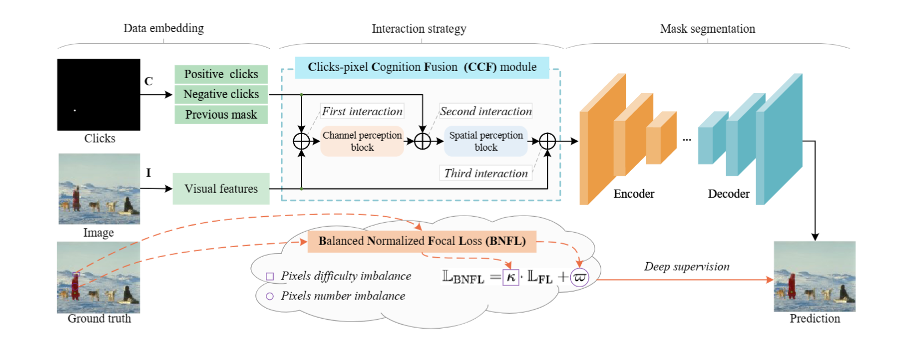

### <p align="center"> Click-pixel Cognition Fusion Network with Balanced Cut for Interactive Image Segmentation
<br>

<div align="center">
  Jiacheng&nbsp;Lin</a> <b>&middot;</b>
  Zhiqiang&nbsp;Xiao</a> <b>&middot;</b>
  Xiaohui&nbsp;Wei</a> <b>&middot;</b>
  Puhong&nbsp;Duan</a> <b>&middot;</b>
  Xuan&nbsp;He</a> <b>&middot;</b>
  Renwei&nbsp;Dian</a> <b>&middot;</b>
  Zhiyong&nbsp;Li</a> <b>&middot;</b>
  Shutao&nbsp;Li</a>
  <br> <br>
  <a href="https://ieeexplore.ieee.org/document/10346985" target="_blank">Paper</a>
</div>
</br>

<div align=center></div>


### Environment

Training and evaluation environment: Python 3.9.7, PyTorch 1.13.1, Ubuntu 20.4, CUDA 11.7. Run the following command to install required packages.

```
pip3 install -r requirements.txt
```

### Evaluation


Before evaluation, please download the datasets and models, and then configure the path in [config.yaml](./config.yaml).

Use the following code to evaluate the base model.

```
python scripts/evaluate_model.py NoBRS \
--gpu=0 \
--checkpoint=checkpoint.pth \
--eval-mode=cvpr \
--datasets=GrabCut,Berkeley,DAVIS,SBD
```

### Training

Before training, please download the HRNet  pretrained weights from  [RITM Github](https://github.com/saic-vul/ritm_interactive_segmentation).

Use the following code to train a base model on SBD ataset:

```
CUDA_VISIBLE_DEVICES=0 \
python train.py models/iter_mask/hrnet18_sbd_itermask_3p.py \
--batch-size=28 \
--ngpus=1
```

### Download

Datasets: [RITM Github](https://github.com/saic-vul/ritm_interactive_segmentation)


### License

The code is released under the MIT License. It is a short, permissive software license. Basically, you can do whatever you want as long as you include the original copyright and license notice in any copy of the software/source.

## Citation
~~~bibtex
@article{lin2024click,
  author={Lin, Jiacheng and Xiao, Zhiqiang and Wei, Xiaohui and Duan, Puhong and He, Xuan and Dian, Renwei and Li, Zhiyong and Li, Shutao},
  journal={IEEE Transactions on Image Processing}, 
  title={Click-Pixel Cognition Fusion Network With Balanced Cut for Interactive Image Segmentation}, 
  year={2024},
  volume={33},
  pages={177-190},
  doi={10.1109/TIP.2023.3338003}
}
~~~

## Acknowledgement
Our project is developed based on [RITM](https://github.com/saic-vul/ritm_interactive_segmentation). Thanks for their excellence works.
